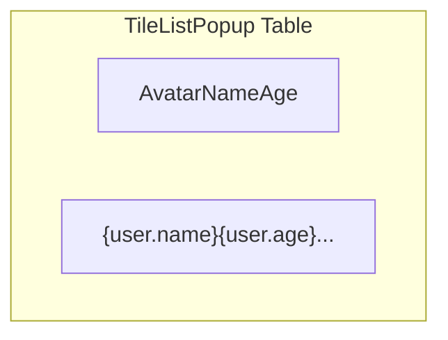

# Plan: Update Marker Cluster Popup Display

## Objective

Modify the popup displayed when clicking on marker clusters (specifically the tile-based aggregates at zoom >= 14) to show user **avatar**, **name**, and **age** instead of the current name, budget, and status.

## Investigation Summary

1.  The relevant popup is rendered by `src/components/UI/TileListPopup.tsx`.
2.  The required data (`avatar_url`, `age`) is already fetched efficiently by the `useMapData` hook (`src/hooks/useMapData.ts`) and included in the `MapUser` objects passed down to the popup component.
3.  No changes are needed to the data fetching logic.

## Implementation Steps

1.  **Modify `src/components/UI/TileListPopup.tsx`:**
    *   **Table Header:** Change the `<thead>` section to reflect the new columns: "Avatar", "Name", "Age".
    *   **Table Body:** Update the `<tbody>` rendering logic within the `userItems.map` function:
        *   Replace the budget cell (`<td>`) with a new cell displaying the user's avatar using an `` tag.
            *   Source the image from `user.avatar_url`.
            *   Include a placeholder (e.g., initials or a default icon) if `user.avatar_url` is null or empty.
            *   Apply appropriate styling (e.g., `w-8 h-8 rounded-full object-cover`).
        *   Keep the existing cell displaying `user.name`.
        *   Replace the status cell (`<td>`) with a new cell displaying `user.age`.
            *   Handle potential `null` or `undefined` values for age (e.g., display 'N/A' or '—').
    *   **Cleanup:** Remove the unused `formatBudget` helper function and its usage.

## Conceptual Table Layout

## Next Step

Switch to Code mode to implement the changes in `src/components/UI/TileListPopup.tsx`.