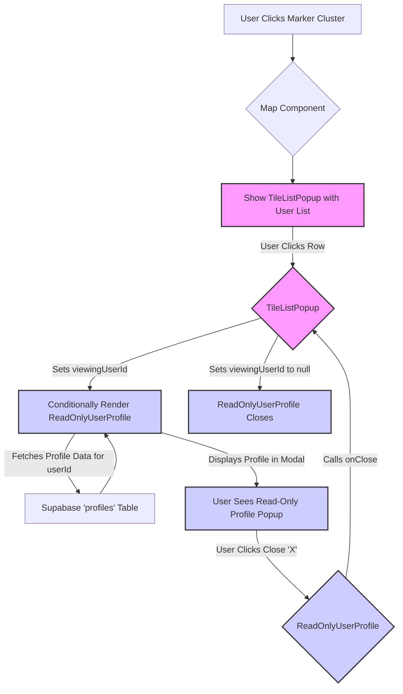

# Plan: User Profile Popup from Marker Cluster

This document outlines the plan to implement a feature where clicking a user in the marker cluster list popup opens a second popup displaying that user's read-only profile.

## Requirements

- When a user clicks on a marker cluster, a popup (`TileListPopup`) appears showing users in that cluster.
- Clicking a user row in this list should open a *second*, larger popup.
- This second popup should display the clicked user's profile information in a read-only format, visually similar to the current user's profile view (`UserProfile.tsx` view mode).
- The original marker cluster list popup (`TileListPopup`) should remain open underneath the profile popup.
- The profile popup should have a close button.

## Implementation Plan

**Phase 1: Create the Read-Only Profile View Component**

1.  **New Component:** Create `src/components/Profile/ReadOnlyUserProfile.tsx`.
2.  **Functionality:**
    *   Accept props: `userId: string`, `onClose: () => void`.
    *   Fetch profile data for the given `userId` from Supabase (`profiles` table).
    *   Render data using layout/styling from `UserProfile.tsx` view mode (read-only).
    *   Exclude edit controls, password fields, location editing, sign-out, delete options.
    *   Include loading and error states.
3.  **Styling:** Style as a modal/popup overlay with a close ('X') button triggering `onClose`.

**Phase 2: Integrate into the Marker Cluster Popup**

1.  **Modify `TileListPopup.tsx`:**
    *   **State:** Add state `viewingUserId: string | null` initialized to `null`.
    *   **Click Handler:** Add `onClick={() => setViewingUserId(user.user_id)}` to the user table row (`<tr>`).
    *   **Conditional Rendering:** Render `<ReadOnlyUserProfile userId={viewingUserId} onClose={() => setViewingUserId(null)} />` when `viewingUserId` is not null.

## Visual Flow Diagram (Mermaid)

## Key Considerations

*   **Simplicity:** Reuses existing UI elements and logic. Dedicated read-only component separates concerns.
*   **Performance:** Fetches profile data on demand. Caching can be added later if needed.
*   **Robustness:** Clear separation of components and state management.