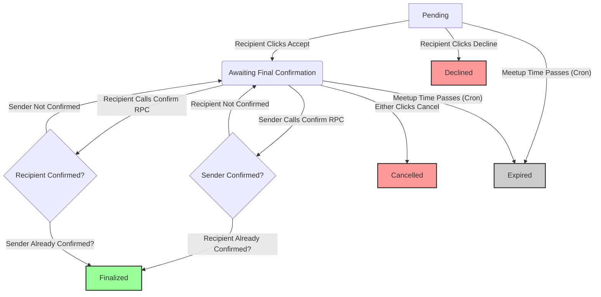

# Meetup Confirmation Flow & History Tab Implementation Plan

**Overall Goal:** Implement a two-step meetup confirmation process, add relevant proposal statuses, and create a "History" tab with a calendar view for finalized meetups.

**Phase 1: Backend and Type Preparation**

1.  **Database Schema (Supabase):**
    *   **Update `status` Column:** Modify the `status` column (`TEXT`) in the `meetup_proposals` table to allow new values by updating its `CHECK` constraint. New values needed: `awaiting_final_confirmation`, `finalized`, `cancelled`, `expired`.
    *   **Add Confirmation Columns:** Add `sender_confirmed: boolean` (DEFAULT false) and `recipient_confirmed: boolean` (DEFAULT false) to `meetup_proposals`.
    *   **Implement Confirmation Function:** Create a database function (`confirm_meetup_proposal`) to handle setting confirmation flags and finalizing the status.
    *   **Review RLS Policies:** Ensure policies allow users to perform actions (accept, decline, confirm via function, cancel, delete) based on their role and proposal status.

2.  **Frontend Type (`src/types/meetup.ts`):**
    *   Update the `MeetupProposal` type to reflect the new `status` values and include `sender_confirmed: boolean` and `recipient_confirmed: boolean`.

**Phase 2: Core Component Modifications (`Header.tsx` & `MeetupRequestRow.tsx`)**

3.  **`Header.tsx` Refactoring:**
    *   **Data Fetching:** Adjust the Supabase query to fetch proposals with all relevant statuses (`pending`, `awaiting_final_confirmation`, `expired`, etc.) for the current user (both as sender and recipient).
    *   **Filtering/Grouping:** Filter the fetched proposals into distinct lists:
        *   `Incoming Requests`: `status === 'pending'` AND recipient is current user.
        *   `Pending Confirmation`: `status === 'awaiting_final_confirmation'` AND (sender OR recipient is current user).
        *   (Optional: `Sent Offers`: `status === 'pending'` AND sender is current user).
        *   (Optional: `Expired`: `status === 'expired`).
    *   **UI Sections:** Update the UI within the relevant tabs (likely managed by `Header.tsx`) to display these different lists, including the new "Pending Confirmation" section.
    *   **New Handlers:** Create and pass down new handler functions to `MeetupRequestRow`:
        *   `handleInitialAccept(proposalId)`: Updates status to `awaiting_final_confirmation`. (Uses direct update with RLS)
        *   `handleFinalConfirm(proposalId)`: Calls the `confirm_meetup_proposal` RPC function.
        *   `handleCancel(proposalId)`: Updates status to `cancelled`. (Uses direct update with RLS)
        *   `handleDecline(proposalId)`: Updates status to `declined`. (Uses direct update with RLS)
        *   (Keep existing `onViewProfile`, `onViewLocation`).

4.  **`MeetupRequestRow.tsx` Refactoring:**
    *   **Props:** Accept the new handler functions.
    *   **Conditional Rendering:** Render buttons and information based on `proposal.status` and confirmation flags:
        *   `pending` (recipient view): Show "Accept" (`handleInitialAccept`), "Decline" (`handleDecline`), "Where?", Profile, disabled "Counter".
        *   `awaiting_final_confirmation`:
            *   Show "Confirm Meetup" (green, calls `handleFinalConfirm`). Disable if *this* user (`sender_confirmed` or `recipient_confirmed`) is already true.
            *   Show "Cancel" (`handleCancel`).
            *   Show "Where?", Profile, disabled "Counter".
            *   Add visual indicator (e.g., text "Waiting for [other user's name]" or "Waiting for you") based on confirmation flags.
        *   `declined`, `cancelled`: Display status text. Show "Where?", Profile. No action buttons.
        *   `expired`: Display status text. Show "Where?", Profile. Grey out all buttons except potentially a functional "Counter" (if desired later).

**Phase 3: History Tab Implementation**

5.  **Install Dependency:** Add `react-calendar`.
6.  **Routing (`src/App.tsx`):** Add a route for `/history` pointing to a new `HistoryPage` component.
7.  **Create `src/pages/HistoryPage.tsx`:**
    *   Fetch `finalized` meetups where the current user is either the sender or recipient.
    *   Implement `react-calendar`. Use `tileClassName` or `tileContent` props to highlight dates containing finalized meetups (e.g., green background).
    *   Manage the selected date state.
    *   Below the calendar, display the details of finalized meetups occurring on the selected date (using a component similar to `MeetupRequestRow` but adapted for display-only).
8.  **Navigation:** Add a link/button to the History page (likely in `Header.tsx`).

**Phase 4: Backend Logic & Automation**

9.  **Supabase Logic:** Implement the database update logic within the handler functions in `Header.tsx` (using `supabaseClient` for direct updates and RPC calls).
10. **Expiration Handling (Optional but Recommended):**
    *   Create and schedule the `handle_expired_meetups` database function.

**Diagram: Proposal Status Flow**



---

## Consolidated SQL Queries for Meetup Confirmation Flow

Run these in your Supabase SQL Editor or as a migration file. This combines schema changes, the confirmation function, and all necessary RLS policies.

**!! IMPORTANT: Review and ADAPT RLS policies carefully if you have other constraints (like user blocking) not shown here !!**

```sql
-- ============================================================
-- Consolidated SQL for Meetup Confirmation Flow
-- Includes: Schema Changes, Expiration Function, Confirmation Function, RLS Policies
-- ============================================================

-- 1. Update Status Column CHECK Constraint (If not already done)
-- --------------------------------------------------------------------
-- Find constraint name:
-- SELECT constraint_name FROM information_schema.table_constraints
-- WHERE table_name = 'meetup_proposals' AND constraint_type = 'CHECK' AND table_schema = 'public';
-- Assuming 'meetup_proposals_status_check' (REPLACE IF DIFFERENT):
ALTER TABLE public.meetup_proposals DROP CONSTRAINT IF EXISTS meetup_proposals_status_check;

ALTER TABLE public.meetup_proposals
ADD CONSTRAINT meetup_proposals_status_check CHECK (status IN (
  'pending',
  'accepted', -- Kept for potential legacy/other uses
  'declined',
  'countered', -- Kept for potential legacy/other uses
  'awaiting_final_confirmation', -- New
  'finalized', -- New
  'cancelled', -- New
  'expired' -- New
));


-- 2. Add Confirmation Columns (If not already done)
-- --------------------------------------------------------------------
ALTER TABLE public.meetup_proposals
ADD COLUMN IF NOT EXISTS sender_confirmed BOOLEAN DEFAULT false NOT NULL,
ADD COLUMN IF NOT EXISTS recipient_confirmed BOOLEAN DEFAULT false NOT NULL;


-- 3. Create/Update Function for Expiration Handling (If not already done)
-- --------------------------------------------------------------------
CREATE OR REPLACE FUNCTION public.handle_expired_meetups()
RETURNS void
LANGUAGE plpgsql
SECURITY DEFINER
AS $$
BEGIN
  UPDATE public.meetup_proposals
  SET status = 'expired'
  WHERE
    meetup_time < NOW() AND
    status IN ('pending', 'awaiting_final_confirmation');
END;
$$;

-- Optional: Grant execute permission if needed by other roles/triggers
-- GRANT EXECUTE ON FUNCTION public.handle_expired_meetups() TO authenticated;

-- Optional: Schedule via Supabase Dashboard or pg_cron
-- SELECT cron.schedule('handle-expired-meetups-hourly', '0 * * * *', 'SELECT public.handle_expired_meetups()');


-- 4. Create the Confirmation Function (Handles setting flags and finalizing)
-- --------------------------------------------------------------------
CREATE OR REPLACE FUNCTION public.confirm_meetup_proposal(p_proposal_id UUID)
RETURNS TEXT -- Returns a status message
LANGUAGE plpgsql
SECURITY DEFINER -- Runs with function owner privileges for controlled update
AS $$
DECLARE
  proposal RECORD;
  current_user_id UUID := auth.uid();
  updated_status TEXT;
BEGIN
  -- Fetch the proposal details
  SELECT * INTO proposal
  FROM public.meetup_proposals
  WHERE id = p_proposal_id;

  IF NOT FOUND THEN RETURN 'Error: Proposal not found.'; END IF;
  IF proposal.status <> 'awaiting_final_confirmation' THEN RETURN 'Error: Proposal is not awaiting final confirmation.'; END IF;
  IF current_user_id <> proposal.sender_id AND current_user_id <> proposal.recipient_id THEN RETURN 'Error: You are not authorized to confirm this proposal.'; END IF;

  -- Perform the update based on who is calling
  IF current_user_id = proposal.sender_id THEN
    IF proposal.sender_confirmed THEN RETURN 'Info: You have already confirmed this proposal.'; END IF;
    UPDATE public.meetup_proposals SET sender_confirmed = true WHERE id = p_proposal_id;
    -- Re-fetch proposal to check other flag *after* update
    SELECT * INTO proposal FROM public.meetup_proposals WHERE id = p_proposal_id;
    IF proposal.recipient_confirmed THEN
      UPDATE public.meetup_proposals SET status = 'finalized' WHERE id = p_proposal_id;
      RETURN 'Success: Proposal confirmed by sender and finalized.';
    ELSE
      RETURN 'Success: Proposal confirmed by sender. Waiting for recipient.';
    END IF;

  ELSIF current_user_id = proposal.recipient_id THEN
    IF proposal.recipient_confirmed THEN RETURN 'Info: You have already confirmed this proposal.'; END IF;
    UPDATE public.meetup_proposals SET recipient_confirmed = true WHERE id = p_proposal_id;
    -- Re-fetch proposal to check other flag *after* update
    SELECT * INTO proposal FROM public.meetup_proposals WHERE id = p_proposal_id;
    IF proposal.sender_confirmed THEN
      UPDATE public.meetup_proposals SET status = 'finalized' WHERE id = p_proposal_id;
      RETURN 'Success: Proposal confirmed by recipient and finalized.';
    ELSE
      RETURN 'Success: Proposal confirmed by recipient. Waiting for sender.';
    END IF;
  END IF;

EXCEPTION WHEN OTHERS THEN RETURN 'Error: An unexpected error occurred: ' || SQLERRM;
END;
$$;

-- Grant permission to authenticated users to call this function
GRANT EXECUTE ON FUNCTION public.confirm_meetup_proposal(UUID) TO authenticated;

COMMENT ON FUNCTION public.confirm_meetup_proposal(UUID) IS 'Allows sender or recipient to confirm a proposal awaiting final confirmation via RPC. Sets the appropriate flag and finalizes status if both confirm.';


-- 5. RLS Policies for meetup_proposals
-- --------------------------------------------------------------------
-- Ensure RLS is enabled (If not already done)
ALTER TABLE public.meetup_proposals ENABLE ROW LEVEL SECURITY;

-- SELECT Policy: Allow users to view proposals they are involved in.
DROP POLICY IF EXISTS "Allow users to view own proposals" ON public.meetup_proposals;
CREATE POLICY "Allow users to view own proposals"
ON public.meetup_proposals FOR SELECT
USING (auth.uid() = sender_id OR auth.uid() = recipient_id);

-- INSERT Policy: Allow users to create proposals where they are the sender.
DROP POLICY IF EXISTS "Allow users to insert proposals as sender" ON public.meetup_proposals;
CREATE POLICY "Allow users to insert proposals as sender"
ON public.meetup_proposals FOR INSERT
WITH CHECK (auth.uid() = sender_id);

-- UPDATE Policy 1: Allow recipient to accept/decline PENDING proposals.
DROP POLICY IF EXISTS "Allow recipient action on pending proposals" ON public.meetup_proposals;
CREATE POLICY "Allow recipient action on pending proposals"
ON public.meetup_proposals FOR UPDATE
USING (
  auth.uid() = recipient_id 
  AND status = 'pending'
)
WITH CHECK (
  -- Only allow certain status transitions
  status IN ('awaiting_final_confirmation', 'declined')
);

-- UPDATE Policy 2: Allow sender/recipient to CANCEL pending/awaiting proposals.
DROP POLICY IF EXISTS "Allow user to cancel proposal" ON public.meetup_proposals;
CREATE POLICY "Allow user to cancel proposal"
ON public.meetup_proposals FOR UPDATE
USING (
  (auth.uid() = sender_id OR auth.uid() = recipient_id)
  AND status IN ('pending', 'awaiting_final_confirmation')
)
WITH CHECK (
  -- Only allow status change to 'cancelled'
  status = 'cancelled'
);

-- UPDATE Policy 3: Allow the confirmation function (SECURITY DEFINER) to operate.
DROP POLICY IF EXISTS "Allow update during confirmation phase" ON public.meetup_proposals;
CREATE POLICY "Allow update during confirmation phase"
ON public.meetup_proposals FOR UPDATE
USING (
  -- This policy is for the confirmation function which runs as SECURITY DEFINER
  status = 'awaiting_final_confirmation'
)
WITH CHECK (
  -- Only allow status to stay the same or change to finalized
  status IN ('awaiting_final_confirmation', 'finalized')
);

-- DELETE Policy: Allow involved users to delete proposals.
DROP POLICY IF EXISTS "Allow involved users to delete proposals" ON public.meetup_proposals;
CREATE POLICY "Allow involved users to delete proposals"
ON public.meetup_proposals FOR DELETE
USING (auth.uid() = sender_id OR auth.uid() = recipient_id);

-- ============================================================
-- End of Consolidated SQL
-- ============================================================
```

**Summary of Changes:**

*   Updated the SQL section to fix the "OLD" reference issue in RLS policies.
*   Adjusted the `WITH CHECK` clauses to ensure compatibility with Supabase's requirements.
*   Refined the function logic slightly for clarity and robustness (re-fetching proposal state after flag update).
*   Kept the existing SELECT, INSERT, and DELETE policies.
*   Updated the Mermaid diagram slightly to reflect RPC calls.

This consolidated script should provide the complete backend setup for your confirmation flow.